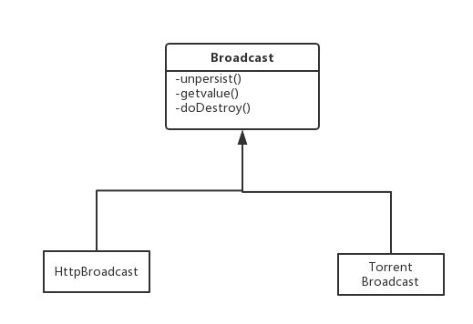

# **Broadcast 广播变量介绍**
## Broadcast是什么
广播变量是spark中实现数据共享的一种方式，其将只读的变量广播到其他的执行节点上去，满足整个执行节点能够访问这一变量的目标。同时又能满足每一个执行节点上只维护一份变量，不同的task共享这一份变量，避免每次task执行的时候都要序列化。其通常用于将一份稍大的数据广播到执行执行节点上，比如将字典数据广播出去.

## 广播变量的如何使用
```
var sc = new SparkContext(sparkConf)
var dict = Map(1->1, 2->2, 3->3)
var broadcastDict = sc.broadcast(dict)
var rdd = sc.parallelize(Array(1, 2, 3))
rdd.foreachPartition(x => broadcastDict.value.get(x))
//手动销毁广播变量，会同时清除掉executor端的
//如果不手动销毁，ContextCleaner会维护一个弱引用列表,当内存不足的时候，会触发整个系统的广播变量的销毁
broadcastDict.onDestory()
```

## 广播变量的机制
广播变量在序列化的时候，会将本地的数据储存到本地的blockmanager中，存储级别是`MEMORY_AND_DISK`,有的也会直接序列化完毕后存储在本地磁盘上(如HttpBroadcast),当其随着task序列化为字节流传递到执行节点的时候，在executor进行反序列化的过程中，会调用`broadcast.readObject`方法，其主要的逻辑是首先从本地的blockmanager中获取broadcastID对应的block，没有的话再去远端获取，不同的广播变量类型获取的方式不一样,Torrent的实现是采用了懒加载的机制，当需要用到value的时候才会通过`readBroadcastBlock`方法获取数据的详情。
* **http的读取写入方式**
```
/** Used by the JVM when serializing this object. */
  private def writeObject(out: ObjectOutputStream): Unit = Utils.tryOrIOException {
    assertValid()
    out.defaultWriteObject()
  }

  /** Used by the JVM when deserializing this object. */
  private def readObject(in: ObjectInputStream): Unit = Utils.tryOrIOException {
    in.defaultReadObject()
    HttpBroadcast.synchronized {
      SparkEnv.get.blockManager.getSingle(blockId) match {
        case Some(x) => value_ = x.asInstanceOf[T]
        case None => {
          logInfo("Started reading broadcast variable " + id)
          val start = System.nanoTime
          value_ = HttpBroadcast.read[T](id)
          /*
           * We cache broadcast data in the BlockManager so that subsequent tasks using it
           * do not need to re-fetch. This data is only used locally and no other node
           * needs to fetch this block, so we don't notify the master.
           */
          SparkEnv.get.blockManager.putSingle(
            blockId, value_, StorageLevel.MEMORY_AND_DISK, tellMaster = false)
          val time = (System.nanoTime - start) / 1e9
          logInfo("Reading broadcast variable " + id + " took " + time + " s")
        }
      }
    }
  }
  ```
  * **Torrent的方式**
  ```
   //懒加载的方式，用到的时候才去远端获取数据
   @transient private lazy val _value: T = readBroadcastBlock()

   private def readBroadcastBlock(): T = Utils.tryOrIOException {
    TorrentBroadcast.synchronized {
      setConf(SparkEnv.get.conf)
      SparkEnv.get.blockManager.getLocal(broadcastId).map(_.data.next()) match {
        case Some(x) =>
          x.asInstanceOf[T]

        case None =>
          logInfo("Started reading broadcast variable " + id)
          val startTimeMs = System.currentTimeMillis()
          val blocks = readBlocks()
          logInfo("Reading broadcast variable " + id + " took" + Utils.getUsedTimeMs(startTimeMs))

          val obj = TorrentBroadcast.unBlockifyObject[T](
            blocks, SparkEnv.get.serializer, compressionCodec)
          // Store the merged copy in BlockManager so other tasks on this executor don't
          // need to re-fetch it.
          SparkEnv.get.blockManager.putSingle(
            broadcastId, obj, StorageLevel.MEMORY_AND_DISK, tellMaster = false)
          obj
      }
    }
  }

  ```


## 广播变量的种类
当前spark1.6.1主要有两种广播变量类型，分别为`HttpBroadcast`和`TorrentBroadcast`，他们的实现机制不同，http的方式是在driver端开启一个用于广播变量的http服务，广播变量会序列化后作为文件存储到本地的磁盘上，task任务反序列化的时候会通过http的方式来fetch相应的数据信息；由于所有的数据都需要从driver端获取，如果executor数目过多的话，会造成driver端的网络拥塞。TorrentBroadcast参看了bit的方式，随着广播变量在executor上存储，其余的executor也会从已经有的executor上fetch相应的数据信息。二者的类图如下所示

